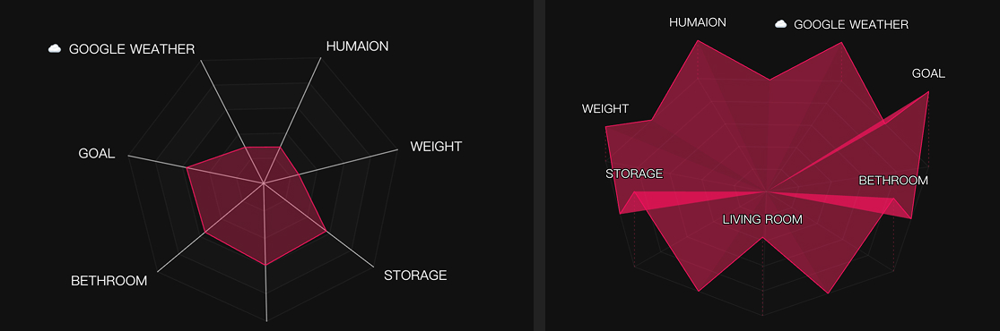

# Prism 3D Data Card

一個為 Home Assistant 設計的未來感 3D 稜鏡數據視覺化卡片。

## 📖 簡介

Prism 3D Data Card 是一個自定義的 Lovelace 卡片，它能將多個實體的數值轉化為精美的 3D 稜鏡或 2D 雷達圖。這款卡片特別適合用於展示環境感測器數據、或是任何需要多維度比較的數值。

## ✨ 主要功能

-   **3D 立體投影**：手動計算的 3D 投影效果，模擬具有傾斜與旋轉感的立體數據模型。
-   **雙顯示模式**：支援「3D 立體」與「2D 平面」模式切換。
-   **豐富的視覺自定義**：
    -   可自定義圖表主色與背景網格顏色。
    -   可調整稜線寬度、透明度、文字大小。
    -   獨特的「3D 明暗差異」設定，增強立體層次感。
-   **動態互動**：內建 ECharts 驅動，支持 Tooltip 數據顯示。
-   **圖形化編輯器**：支援 Home Assistant 內建的 UI 編輯器，無需手動修改 YAML 即可完成所有設定。

## Preview

## 🚀 安裝方式

### 透過 HACS (建議)

1.  開啟 **HACS** > **Frontend**。
2.  點擊右上角的三個點，選擇 **Custom repositories**。
3.  貼上本專案的 GitHub 網址，類別選擇 **Lovelace**。
4.  點擊 **Install**。

### 手動安裝

1.  下載 `prism-3d-card.js`。
2.  將檔案上傳至 Home Assistant 的 `/config/www/` 資料夾。
3.  在 HA 的「資源」設定中加入：`/local/prism-3d-card.js?v=1.0.0` (類型為 JavaScript Module)。

## ⚙️ 配置參數

| 參數 | 類型 | 預設值 | 說明 |
| :--- | :--- | :--- | :--- |
| `color` | string | `#E13460` | 圖表的主色調。 |
| `mode` | string | `3d` | 顯示模式，可選 `3d` 或 `2d`。 |
| `entities` | list | - | 實體列表，包含 `entity`, `name`, `max`。 |
| `rotation` | number | `0` | 3D 模式下的旋轉角度 (0-360)。 |
| `tilt` | number | `0.4` | 3D 模式下的傾斜視角 (0.1-0.9)。 |
| `chart_radius` | number | `65` | 圖表縮放比例 (10-100%)。 |
| `line_width` | number | `2` | 稜線的寬度。 |
| `area_opacity` | number | `0.4` | 數據區域的總透明度。 |
| `opacity_variation` | number | `0.02` | 3D 明暗差異值，增加立體感。 |

## 🛠 開發與測試

本專案附帶一個 `preview.html`，讓開發者可以在不安裝 Home Assistant 的情況下直接預覽效果。

1.  確保 `prism-3d-card.js` 已存在。
2.  使用 **Live Server** (VS Code 插件) 開啟 `preview.html`。
3.  您可以修改 `preview.html` 中的模擬數據來測試各種視覺邊界情況。

## 📝 貢獻與反饋

如果您發現任何 Bug 或有功能建議，歡迎提交 Issue 或 Pull Request！

---

*Made with ❤️ for the Home Assistant community.*
